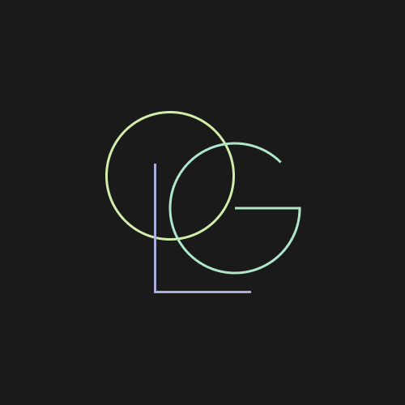
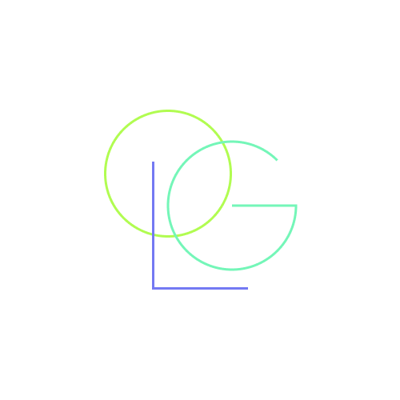

# Ophelia GL

Ophelia Game Library é um projeto codificado em C++ para organização, pesquisa e filtragem de jogos por meio de uma Red-Black Tree.

## Apresentação

Uma apresentação dos conceitos de árvore RB e dos slides pode ser encontrado [aqui](https://www.canva.com/design/DAFjq_kOZ3Y/uOA-77cP5ejmizxfaulXaQ/edit?utm_content=DAFjq_kOZ3Y&utm_campaign=designshare&utm_medium=link2&utm_source=sharebutton).

